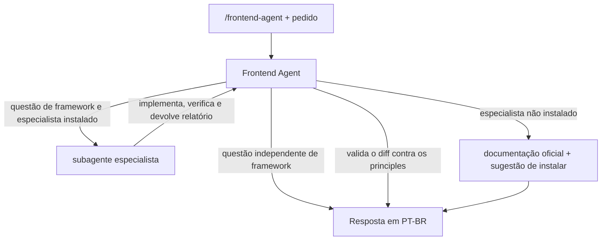

# Frontend Agent

Agente especialista em engenharia frontend para o Cursor, independente de framework, com subagentes especialistas por framework instalados sob demanda.

Ele projeta, implementa, revisa, refatora e diagnostica aplicações Web com foco em JavaScript, TypeScript, HTML, CSS, Web Platform, HTTP, performance, acessibilidade, segurança, testes e arquitetura. Respeita o `architecture.md` de cada projeto e as versões reais das dependências. Questões que dependem de um framework são delegadas ao especialista correspondente.

## Subagentes

| Subagente | Framework | Documentação |
|---|---|---|
| `nextjs-specialist` | Next.js / React | [subagents/nextjs/README.md](subagents/nextjs/README.md) |
| `angular-specialist` | Angular v16+ | [subagents/angular/README.md](subagents/angular/README.md) |

## Estrutura

```text
frontend-agent/
├── agent.md                  # agente principal: núcleo do prompt + índice dos princípios
├── SKILL.md -> agent.md      # o Cursor exige o nome SKILL.md
├── architecture/
│   └── architecture.md       # modelo de architecture.md para os projetos
├── principles/               # lidos sob demanda, conforme o assunto
│   ├── architecture.md
│   ├── performance.md
│   ├── typescript.md
│   ├── javascript.md
│   ├── web-platform.md
│   ├── http.md
│   ├── state-management.md
│   ├── css-ui.md
│   ├── accessibility.md
│   ├── security.md
│   └── testing.md            # estratégia de testes + roteiro de code review
├── subagents/
│   └── <framework>/          # um subagente por pasta (agent.md, referências, README.md, detect)
├── scripts/
│   └── install.sh            # instalador (global ou por projeto, subagentes sob demanda)
└── evals/
    └── scenarios.md          # cenários de teste manual
```

O `agent.md` é mantido enxuto. Ele contém um índice que diz qual arquivo de `principles/` ler para cada assunto, então só o necessário entra no contexto. Os subagentes seguem a mesma ideia e reaproveitam os `principles/` em vez de duplicá-los.

## Como funciona



1. O Frontend Agent levanta o contexto: versões instaladas, `architecture.md`, convenções do projeto.
2. Se a questão depende de um framework, ele confere se o especialista está instalado e dispara o subagente com um bloco de contexto autossuficiente (versão, router, regras de arquitetura, problema, objetivo, restrições, arquivos, workspace).
3. O especialista implementa, roda typecheck, lint, testes, build e, quando possível, verificação no navegador, e devolve um relatório.
4. O Frontend Agent revisa o diff contra os `principles/`, faz a verificação visual se o especialista não conseguiu, e responde ao usuário.

## Instalação

O repositório é a fonte única. Clone uma vez por máquina e use o instalador para colocar o agente onde precisar:

```bash
git clone git@github.com:<usuario>/frontend-agent.git ~/.frontend-agent
```

### Instalação interativa

Na raiz do projeto:

```bash
~/.frontend-agent/scripts/install.sh
```

O instalador pergunta:

1. **Onde instalar:** neste projeto (`./.cursor`) ou global (`~/.cursor`).
2. **Quais subagentes:** lista os disponíveis e já sugere os que combinam com o `package.json` (por exemplo, `nextjs-specialist` quando há `next`). Você pode instalar um, vários, todos (`a`) ou nenhum (`n`).

### Escopos

| Escopo | Destino | Modo | Quando usar |
|---|---|---|---|
| Projeto | `<projeto>/.cursor/skills/frontend-agent` e `<projeto>/.cursor/agents/` | cópia | O time inteiro usa o agente: faça commit dos arquivos e todos recebem pelo git do projeto. |
| Global | `~/.cursor/skills/frontend-agent` e `~/.cursor/agents/` | symlink para o clone | Uso pessoal em todos os projetos da máquina. `git pull` no clone atualiza tudo. |

Na instalação por projeto, só os subagentes escolhidos são copiados, e os caminhos dos prompts são ajustados para `.cursor/skills/frontend-agent/`.

### Comandos

```bash
install.sh --project [DIR] --subagents nextjs   # projeto, sem perguntas
install.sh --global --all                       # global, todos os subagentes
install.sh --global --copy --none               # global por cópia, só o agente principal
install.sh --add nextjs                         # adiciona subagentes a uma instalação existente
install.sh --remove nextjs                      # remove subagentes
install.sh --list                               # disponíveis e instalados
install.sh --update                             # git pull no clone e reaplica a instalação
install.sh --uninstall                          # remove agente, subagentes e manifesto
install.sh --help
```

Sem `--project` ou `--global`, os comandos de manutenção usam a instalação do projeto atual, se houver, ou a global. `-y` desliga as perguntas (útil em scripts).

Cada instalação grava um manifesto (`.cursor/frontend-agent.json` ou `~/.cursor/frontend-agent.json`) com a versão (commit) e os subagentes instalados. O instalador nunca apaga nem sobrescreve arquivos que não tenha criado: se houver conflito, ele para sem alterar nada.

Depois de instalar, recarregue a janela do Cursor.

## Uso

Em qualquer projeto no Cursor:

```text
/frontend-agent revise o componente src/ui/modal.ts
```

A skill tem `disable-model-invocation: true`, então só é carregada quando invocada explicitamente. Para permitir que o Cursor a carregue automaticamente em tarefas de frontend, remova essa linha do frontmatter do `agent.md`.

Os subagentes também podem ser chamados diretamente ("Use the nextjs-specialist subagent to ...", "Use the angular-specialist subagent to ..."). Nesse caso, a validação pelo Frontend Agent não acontece.

## Arquitetura dos projetos

Copie [architecture/architecture.md](architecture/architecture.md) para a raiz do projeto (ou `docs/architecture.md`) e preencha. O agente trata esse arquivo como fonte de verdade: as regras do projeto vencem os princípios gerais. A subseção "Framework" é lida pelos especialistas.

## Como estender

- **Novo princípio:** crie `principles/<tema>.md` e adicione uma linha na tabela do item 5.2 do `agent.md`.
- **Novo subagente de framework:**
  1. crie `subagents/<framework>/agent.md` com frontmatter `name` e `description`, e os arquivos de referência;
  2. crie `subagents/<framework>/detect` com os pacotes que identificam o framework, um por linha (ex.: `@angular/core`);
  3. crie `subagents/<framework>/README.md` e adicione uma linha na tabela "Subagentes" deste README;
  4. adicione uma linha na tabela "Especialistas disponíveis" da seção 9 do `agent.md`;
  5. adicione cenários em `evals/scenarios.md`.

  O instalador descobre o subagente sozinho, sem precisar editar o script. Nos prompts, referencie arquivos pelo caminho global (`~/.cursor/skills/frontend-agent/...`); o instalador ajusta esses caminhos nas instalações por projeto.
- **Validação:** depois de alterar um prompt, rode os cenários afetados em [evals/scenarios.md](evals/scenarios.md).
